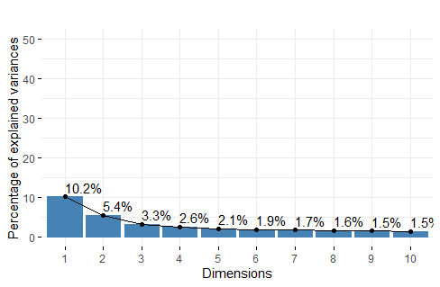
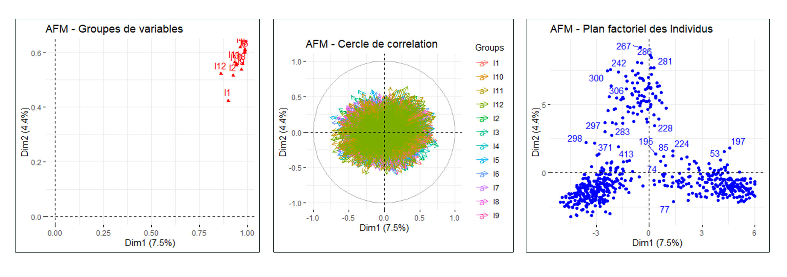

# Apprentissage-non-supervise (NLP, Réduction de la dimension et Clustering)

## Analyse des Coposantes Pricipales (ACP) sur les 12 couches de BERT

## Analyse Factorielle Multiple (AFM) sur les 12 couches de BERT
  

## Hierarchical clustering (CAH) sur BERT

## k-means clustering sur deux Datasets BERT (à 3/4 classes)

## Evaluation par projection des classes réel sur l'ACP

## Application de l'Analyse Factorielle Discriminante (AFD)

